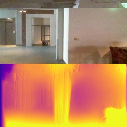

# PyDnet based Collision Avoidance
This repository contains the source code of pydnet-based collision avoidance implemented on a DJI-Tello drone, as proposed in the paper "Towards real-time unsupervised monocular depth estimation on CPU", IROS 2018.

For more details on the research:
[arXiv](https://arxiv.org/abs/1806.11430)

## Requirements

* `Tensorflow 1.8` (recomended) 
* `python packages` such as opencv, matplotlib

## Run pydnet on webcam stream

To run pydnet, just launch

```
python3 tello_pydnet_interface.py --checkpoint_dir /checkpoint/IROS18/pydnet --resolution [1,2,3]
```

## Train pydnet from scratch

### Requirements

* `monodepth (https://github.com/mrharicot/monodepth)` framework by Clément Godard

After you have cloned the monodepth repository, add to it the scripts contained in `training_code` folder from this repository (you have to replace the original `monodepth_model.py` script).
Then you can train pydnet inside monodepth framework.

## Evaluate pydnet on Eigen split

To get results on the Eigen split, just run

```
python3 experiments.py --datapath PATH_TO_KITTI --filenames PATH_TO_FILELIST --checkpoint_dir /checkpoint/IROS18/pydnet --resolution [1,2,3]
```

This script generates `disparity.npy`, that can be evaluated using the evaluation tools by Clément Godard 

<div align="center">
  <a href="https://www.youtube.com/watch?v=RMD8G3Na71s"></a>
</div>
